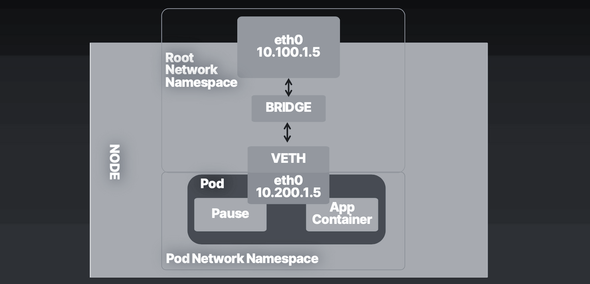
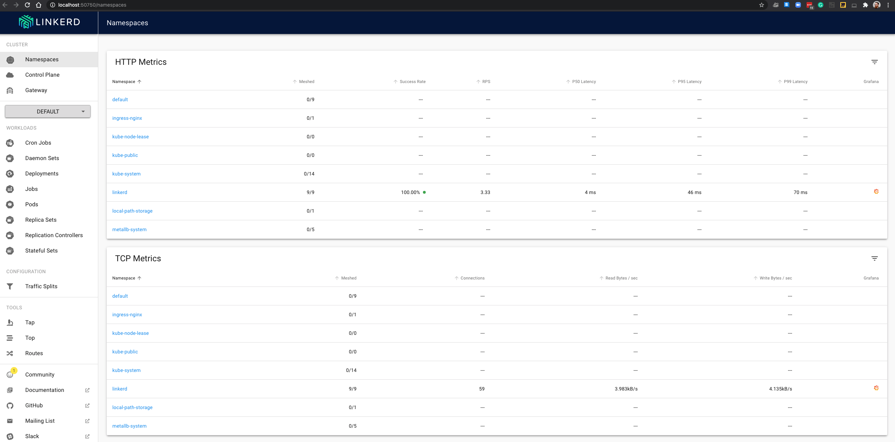
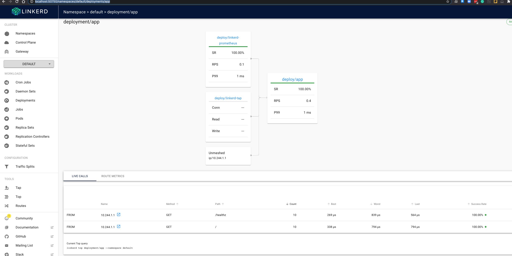
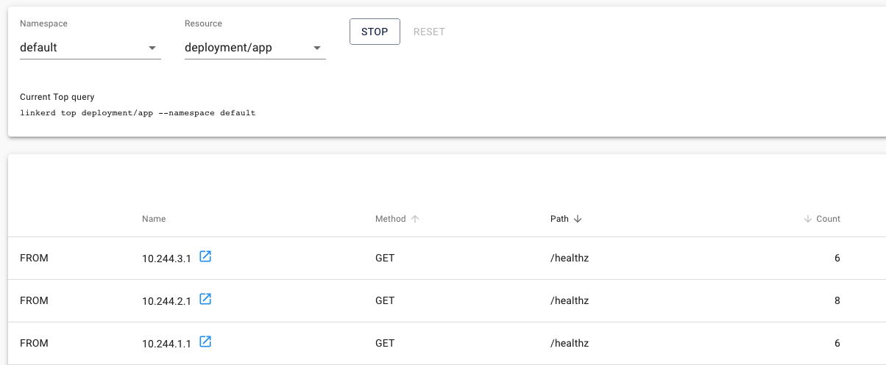

Tools Needed:

- Docker
- Kind
- Linkerd

Commands:

- http://man7.org/linux/man-pages/man8/ip-netns.8.html[netns]
- http://man7.org/linux/man-pages/man8/ip.8.html[ip]
- https://docs.docker.com/engine/reference/commandline/container_exec/[docker exec]
- https://kubernetes.io/docs/reference/generated/kubectl/kubectl-commands#exec[kubectl exec]

Docker install can be found https://docs.docker.com/engine/install/[here]

Kind install can be found https://kind.sigs.k8s.io/docs/user/quick-start/#installation[here]

Steps

1. Deploy Kind Cluster with ingress enabled
2. Explore StatefulSets
3. Deploy Kubernetes Services
4. Deploy an Ingress Controller
5. Service Mesh
6. Clean up 

We will explore these Kubernetes Networking Abstractions

[#img-pod-connection]
.Pod on Host

StatefulSets

Services

- NodePort
- Cluster
- LoadBalancer
- Headless
- Endpoints
- Endpoint Slices

Ingress

- Ingress Controller
- Ingress rules

Service Mesh

- Linkerd

== Deploy Kind Cluster with ingress enabled

With the kind cluster configuration yaml, we can use kind to create that cluster with the below command. If this is the first time running it, it will take some time to download all the docker images for the working and control plane docker images.

[source,bash]
----
 kind create cluster --config=kind-ingress.yaml
Creating cluster "kind" ...
 ✓ Ensuring node image (kindest/node:v1.18.2) 🖼
 ✓ Preparing nodes 📦
 ✓ Writing configuration 📜
 ✓ Starting control-plane 🕹️
 ✓ Installing CNI 🔌
 ✓ Installing StorageClass 💾
Set kubectl context to "kind-kind"
You can now use your cluster with:

kubectl cluster-info --context kind-kind

Have a question, bug, or feature request? Let us know! https://kind.sigs.k8s.io/#community 🙂

----

dnsutils is used for https://github.com/kubernetes/kubernetes/tree/master/test/images[kubernetes end-to-end testing]

[source,bash]
----
kubectl apply -f dnsutils.yaml 
 
pod/dnsutils created

kubectl get pods
NAME       READY   STATUS    RESTARTS   AGE
dnsutils   1/1     Running   0          9s
----

== Explore StatefulSets

StatefulSets are valuable for applications that require: 

* Stable, unique network identifiers.
* Stable, persistent storage.
* Ordered, graceful deployment and scaling.
* Ordered, automated rolling updates.

Our Database for the Golang Minimal web server is deployed as a statefulset. The database has a service, a configmap for the postgres username, password and test database name and a statefulset
for the containers running postgres. 

Let us deploy it now. 

[source,bash]
----
kubectl apply -f database.yaml
service/postgres created
configmap/postgres-config created
statefulset.apps/postgres created
----

With the replica set to two, we see the statefulset deploy postgres-0 and postgres-1, in that order.

Let us examine the dns and network ramifications of using a statefulset. 

[source,bash]
----
kubectl get pods -o wide
NAME         READY   STATUS    RESTARTS   AGE   IP           NODE           NOMINATED NODE   READINESS GATES
dnsutils     1/1     Running   0          15m   10.244.3.2   kind-worker3   <none>           <none>
postgres-0   1/1     Running   0          15m   10.244.1.3   kind-worker2   <none>           <none>
postgres-1   1/1     Running   0          14m   10.244.2.3   kind-worker    <none>           <none>
----

Two pods for our postgres statefulset were deployed with names, postgres-0 and 1, with IP address 10.244.1.3 and 10
.244.2.3 respectively.

[source,bash ]
----
kubectl get svc postgres
NAME       TYPE        CLUSTER-IP       EXTERNAL-IP   PORT(S)    AGE
postgres   ClusterIP   10.105.214.153   <none>        5432/TCP   23m
----

Using our dnsutils image we can see that the DNS names for the statefulsets will return those IP Addresses along
with the cluster IP of the postgres service. 

[source,bash]
----
kubectl exec dnsutils -- host postgres-0.postgres.default.svc.cluster.local.
postgres-0.postgres.default.svc.cluster.local has address 10.244.1.3

kubectl exec dnsutils -- host postgres-1.postgres.default.svc.cluster.local.
postgres-1.postgres.default.svc.cluster.local has address 10.244.2.3

kubectl exec dnsutils -- host postgres
postgres.default.svc.cluster.local has address 10.105.214.153
----

== Services

We will use the Golang minimal webserver for all the services examples. We have added additional functionality to the
application to display which hosts and the pods ip in the Rest request.

Before we deploy the services, we must first deploy the web server that the services will be routing traffic too.

[source,bash]
----
 kubectl apply -f web.yml
deployment.apps/app created

kubectl get pods -o wide
NAME                  READY   STATUS    RESTARTS   AGE   IP           NODE           NOMINATED NODE   READINESS GATES
app-9cc7d9df8-ffsm6   1/1     Running   0          49s   10.244.1.4   kind-worker2   <none>           <none>
dnsutils              1/1     Running   0          49m   10.244.3.2   kind-worker3   <none>           <none>
postgres-0            1/1     Running   0          48m   10.244.1.3   kind-worker2   <none>           <none>
postgres-1            1/1     Running   0          48m   10.244.2.3   kind-worker    <none>           <none>

----

The Pods API address of our web server is `10.244.1.4`, which can be resolved in the cluster DNS.

[source,bash]
----
kubectl exec dnsutils -- host  10.244.1.4
4.1.244.10.in-addr.arpa domain name pointer 10-244-1-4.clusterip-service.default.svc.cluster.local.

----

Now that our applications is deployed we can begin exploring the various services available in the Kubernetes API.

===  NodePort

Let us scale up the Deployment of our web app.

[source,bash]
----
 kubectl scale deployment app --replicas 4
deployment.apps/app scaled

 kubectl get pods -l app=app -o wide
NAME                  READY   STATUS    RESTARTS   AGE   IP           NODE           NOMINATED NODE   READINESS GATES
app-9cc7d9df8-9d5t8   1/1     Running   0          43s   10.244.2.4   kind-worker    <none>           <none>
app-9cc7d9df8-ffsm6   1/1     Running   0          75m   10.244.1.4   kind-worker2   <none>           <none>
app-9cc7d9df8-srxk5   1/1     Running   0          45s   10.244.3.4   kind-worker3   <none>           <none>
app-9cc7d9df8-zrnvb   1/1     Running   0          43s   10.244.3.5   kind-worker3   <none>           <none>

----

With 4 pods running we have one pod at every node in the cluster.

[source,bash]
----
 kubectl get pods -o wide -l app=app
NAME                   READY   STATUS    RESTARTS   AGE   IP           NODE           NOMINATED NODE   READINESS GATES
app-5586fc9d77-7frts   1/1     Running   0          31s   10.244.1.5   kind-worker2   <none>           <none>
app-5586fc9d77-mxhgw   1/1     Running   0          31s   10.244.3.9   kind-worker3   <none>           <none>
app-5586fc9d77-qpxwk   1/1     Running   0          84s   10.244.2.7   kind-worker    <none>           <none>
app-5586fc9d77-tpz8q   1/1     Running   0          31s   10.244.2.8   kind-worker    <none>           <none>

----

Get the IP address of node-worker

[source,bash]
----
kubectl get nodes -o wide
NAME                 STATUS   ROLES    AGE    VERSION   INTERNAL-IP   EXTERNAL-IP   OS-IMAGE       KERNEL-VERSION      CONTAINER-RUNTIME
kind-control-plane   Ready    master   3h1m   v1.18.2   172.18.0.5    <none>        Ubuntu 19.10   4.19.121-linuxkit   containerd://1.3.3-14-g449e9269
kind-worker          Ready    <none>   3h     v1.18.2   172.18.0.3    <none>        Ubuntu 19.10   4.19.121-linuxkit   containerd://1.3.3-14-g449e9269
kind-worker2         Ready    <none>   3h     v1.18.2   172.18.0.4    <none>        Ubuntu 19.10   4.19.121-linuxkit   containerd://1.3.3-14-g449e9269
kind-worker3         Ready    <none>   3h     v1.18.2   172.18.0.2    <none>        Ubuntu 19.10   4.19.121-linuxkit   containerd://1.3.3-14-g449e9269
----

Now let's deploy our NodePort Service

[source,bash]
----
kubectl apply -f services-nodeport.yaml
service/nodeport-service created

kubectl describe svc nodeport-service
Name:                     nodeport-service
Namespace:                default
Labels:                   <none>
Annotations:              Selector:  app=app
Type:                     NodePort
IP:                       10.101.85.57
Port:                     echo  8080/TCP
TargetPort:               8080/TCP
NodePort:                 echo  30040/TCP
Endpoints:                10.244.1.5:8080,10.244.2.7:8080,10.244.2.8:8080 + 1 more...
Session Affinity:         None
External Traffic Policy:  Cluster
Events:                   <none>

----

External Communication uses the nodeport of each worker

[source,bash]
----
kubectl exec -it dnsutils -- wget -q -O-  172.18.0.5:30040/host
NODE: kind-worker2, POD IP:10.244.1.5

kubectl exec -it dnsutils -- wget -q -O-  172.18.0.3:30040/host
NODE: kind-worker, POD IP:10.244.2.8

kubectl exec -it dnsutils -- wget -q -O-  172.18.0.4:30040/host
NODE: kind-worker2, POD IP:10.244.1.5
----

The downside of using Nodeport service type is that the Host IP address must be known. Also Ports must tracked across
all applications. A nodeport deployment will fail if it can not allocate the requested port.

=== Cluster IP

*ClusterIP Service*

The first service will we will deploy is the default the ClusterIP service.

[source,bash]
----
kubectl apply -f service-clusterip.yaml
service/clusterip-service created

kubectl describe svc clusterip-service
Name:              clusterip-service
Namespace:         default
Labels:            app=app
Annotations:       Selector:  app=app
Type:              ClusterIP
IP:                10.98.252.195
Port:              <unset>  80/TCP
TargetPort:        8080/TCP
Endpoints:         <none>
Session Affinity:  None
Events:            <none>
----

The Cluster service name is resolvable in the network

[source, bash]
----
kubectl exec dnsutils -- host clusterip-service
clusterip-service.default.svc.cluster.local has address 10.98.252.195
----

Now we can reach the Host API endpoint with The Cluster IP, `10.98.252.195`, The Service Name, `clusterip-service`,
or the directly with the pod IP `10.244.1.4` and port `8080`.

[source,bash]
----
kubectl exec dnsutils -- wget -q -O- clusterip-service/host
NODE: kind-worker2, POD IP:10.244.1.4

kubectl exec dnsutils -- wget -q -O- 10.98.252.195/host
NODE: kind-worker2, POD IP:10.244.1.4

kubectl exec dnsutils -- wget -q -O- 10.244.1.4:8080/host
NODE: kind-worker2, POD IP:10.244.1.4
----

Let us explore what the Service Cluster IP abstracted for us.

* View veth pair and match with pod
* View network namespace and match with pod
* Verify pids on node match pods
* Match services with iptables rules

To explore this we need to know what Worker node the pod is deployed too, and that is `kind-worker2`

[source,bash]
----
kubectl get pods -o wide
NAME                  READY   STATUS    RESTARTS   AGE     IP           NODE           NOMINATED NODE   READINESS GATES
app-9cc7d9df8-ffsm6   1/1     Running   0          7m23s   10.244.1.4   kind-worker2   <none>           <none>
dnsutils              1/1     Running   0          55m     10.244.3.2   kind-worker3   <none>           <none>
postgres-0            1/1     Running   0          55m     10.244.1.3   kind-worker2   <none>           <none>
postgres-1            1/1     Running   0          54m     10.244.2.3   kind-worker    <none>           <none>

----

Since we are using kind we can use `docker ps` and `docker exec` to get information out of the running worker node
`kind-worker-2`

[source, bash]
----
docker ps
CONTAINER ID   IMAGE                  COMMAND                  CREATED             STATUS             PORTS                                                                 NAMES
df6df0736958   kindest/node:v1.18.2   "/usr/local/bin/entr…"   About an hour ago   Up About an hour                                                                         kind-worker2
e242f11d2d00   kindest/node:v1.18.2   "/usr/local/bin/entr…"   About an hour ago   Up About an hour                                                                         kind-worker
a76b32f37c0e   kindest/node:v1.18.2   "/usr/local/bin/entr…"   About an hour ago   Up About an hour                                                                         kind-worker3
07ccb63d870f   kindest/node:v1.18.2   "/usr/local/bin/entr…"   About an hour ago   Up About an hour   0.0.0.0:80->80/tcp, 0.0.0.0:443->443/tcp, 127.0.0.1:52321->6443/tcp   kind-control-plane
----

`kind-worker2` container id is `df6df0736958`, kind was kind enough to label each container with names, so we can
reference each worker node with its name `kind-worker2`

[source,bash]
----
 docker exec -it kind-worker2 ip a
1: lo: <LOOPBACK,UP,LOWER_UP> mtu 65536 qdisc noqueue state UNKNOWN group default qlen 1000
    link/loopback 00:00:00:00:00:00 brd 00:00:00:00:00:00
    inet 127.0.0.1/8 scope host lo
       valid_lft forever preferred_lft forever
    inet6 ::1/128 scope host
       valid_lft forever preferred_lft forever
2: tunl0@NONE: <NOARP> mtu 1480 qdisc noop state DOWN group default qlen 1000
    link/ipip 0.0.0.0 brd 0.0.0.0
3: ip6tnl0@NONE: <NOARP> mtu 1452 qdisc noop state DOWN group default qlen 1000
    link/tunnel6 :: brd ::
4: veth608eddaa@if5: <BROADCAST,MULTICAST,UP,LOWER_UP> mtu 1500 qdisc noqueue state UP group default
    link/ether 76:e6:c5:a4:71:7d brd ff:ff:ff:ff:ff:ff link-netns cni-c18c44cb-6c3e-c48d-b783-e7850d40e01c
    inet 10.244.1.1/32 brd 10.244.1.1 scope global veth608eddaa
       valid_lft forever preferred_lft forever
5: veth45d1f3e8@if5: <BROADCAST,MULTICAST,UP,LOWER_UP> mtu 1500 qdisc noqueue state UP group default
    link/ether 3e:39:16:38:3f:23 brd ff:ff:ff:ff:ff:ff link-netns cni-ec37f6e4-a1b5-9bc9-b324-59d612edb4d4
    inet 10.244.1.1/32 brd 10.244.1.1 scope global veth45d1f3e8
       valid_lft forever preferred_lft forever
11: eth0@if12: <BROADCAST,MULTICAST,UP,LOWER_UP> mtu 1500 qdisc noqueue state UP group default
    link/ether 02:42:ac:12:00:04 brd ff:ff:ff:ff:ff:ff link-netnsid 0
    inet 172.18.0.4/16 brd 172.18.255.255 scope global eth0
       valid_lft forever preferred_lft forever
    inet6 fc00:f853:ccd:e793::4/64 scope global nodad
       valid_lft forever preferred_lft forever
    inet6 fe80::42:acff:fe12:4/64 scope link
       valid_lft forever preferred_lft forever
----

Let's see our Pods IP address and route table information

[source,bash]
----
kubectl exec app-9cc7d9df8-ffsm6 ip a
1: lo: <LOOPBACK,UP,LOWER_UP> mtu 65536 qdisc noqueue state UNKNOWN group default qlen 1000
    link/loopback 00:00:00:00:00:00 brd 00:00:00:00:00:00
    inet 127.0.0.1/8 scope host lo
       valid_lft forever preferred_lft forever
    inet6 ::1/128 scope host
       valid_lft forever preferred_lft forever
2: tunl0@NONE: <NOARP> mtu 1480 qdisc noop state DOWN group default qlen 1000
    link/ipip 0.0.0.0 brd 0.0.0.0
3: ip6tnl0@NONE: <NOARP> mtu 1452 qdisc noop state DOWN group default qlen 1000
    link/tunnel6 :: brd ::
5: eth0@if5: <BROADCAST,MULTICAST,UP,LOWER_UP> mtu 1500 qdisc noqueue state UP group default
    link/ether 3e:57:42:6e:cd:45 brd ff:ff:ff:ff:ff:ff link-netnsid 0
    inet 10.244.1.4/24 brd 10.244.1.255 scope global eth0
       valid_lft forever preferred_lft forever
    inet6 fe80::3c57:42ff:fe6e:cd45/64 scope link
       valid_lft forever preferred_lft forever

kubectl exec app-9cc7d9df8-ffsm6 ip r
default via 10.244.1.1 dev eth0
10.244.1.0/24 via 10.244.1.1 dev eth0 src 10.244.1.4
10.244.1.1 dev eth0 scope link src 10.244.1.4

----

Our Pods IP Address is `10.244.1.4` running on interface `eth0@if5` with 10.244.1.1 as it's default route.

That matches the interface 5 on the pod

Let's check the Network namespace as well, from the node ip a output

[source,bash]
----
 docker exec -it kind-worker2 ip a
1: lo: <LOOPBACK,UP,LOWER_UP> mtu 65536 qdisc noqueue state UNKNOWN group default qlen 1000
    link/loopback 00:00:00:00:00:00 brd 00:00:00:00:00:00
    inet 127.0.0.1/8 scope host lo
       valid_lft forever preferred_lft forever
    inet6 ::1/128 scope host
       valid_lft forever preferred_lft forever
2: tunl0@NONE: <NOARP> mtu 1480 qdisc noop state DOWN group default qlen 1000
    link/ipip 0.0.0.0 brd 0.0.0.0
3: ip6tnl0@NONE: <NOARP> mtu 1452 qdisc noop state DOWN group default qlen 1000
    link/tunnel6 :: brd ::
4: veth608eddaa@if5: <> UP group default
    link/ether 76:e6:c5:a4:71:7d brd <> link-netns cni-c18c44cb-6c3e-c48d-b783-e7850d40e01c
    inet 10.244.1.1/32 brd 10.244.1.1 scope global veth608eddaa
       valid_lft forever preferred_lft forever
5: veth45d1f3e8@if5: <BROADCAST,MULTICAST,UP,LOWER_UP> mtu 1500 qdisc noqueue state UP group default
    link/ether 3e:39:16:38:3f:23 brd <> link-netns cni-ec37f6e4-a1b5-9bc9-b324-59d612edb4d4
    inet 10.244.1.1/32 brd 10.244.1.1 scope global veth45d1f3e8
       valid_lft forever preferred_lft forever
11: eth0@if12: <BROADCAST,MULTICAST,UP,LOWER_UP> mtu 1500 qdisc noqueue state UP group default
    link/ether 02:42:ac:12:00:04 brd ff:ff:ff:ff:ff:ff link-netnsid 0
    inet 172.18.0.4/16 brd 172.18.255.255 scope global eth0
       valid_lft forever preferred_lft forever
    inet6 fc00:f853:ccd:e793::4/64 scope global nodad
       valid_lft forever preferred_lft forever
    inet6 fe80::42:acff:fe12:4/64 scope link
       valid_lft forever preferred_lft forever
----

And `netns list` confirms that for us.

[source,bash]
----
docker exec -it kind-worker2 /usr/sbin/ip netns list
cni-ec37f6e4-a1b5-9bc9-b324-59d612edb4d4 (id: 2)
cni-c18c44cb-6c3e-c48d-b783-e7850d40e01c (id: 1)
----

Let us see what process/es run inside that network namespace

[source,bash]
----
 docker exec -it kind-worker2 /usr/sbin/ip netns pid cni-ec37f6e4-a1b5-9bc9-b324-59d612edb4d4
4687
4737
----

Let us grep for each process id

[source,bash]
----
docker exec -it kind-worker2 ps aux | grep 4687
root      4687  0.0  0.0    968     4 ?        Ss   17:00   0:00 /pause

docker exec -it kind-worker2 ps aux | grep 4737
root      4737  0.0  0.0 708376  6368 ?        Ssl  17:00   0:00 /opt/web-server
----

`4737` is the process id of our Web server container running on the kind-worker2

[source,bash]
----
docker exec -it kind-worker2 iptables -L
Chain INPUT (policy ACCEPT)
target     prot opt source               destination
KUBE-SERVICES  all  --  anywhere             anywhere             ctstate NEW /* kubernetes service portals */
KUBE-EXTERNAL-SERVICES  all  --  anywhere             anywhere             ctstate NEW /* kubernetes externally-visible service portals */
KUBE-FIREWALL  all  --  anywhere             anywhere

Chain FORWARD (policy ACCEPT)
target     prot opt source               destination
KUBE-FORWARD  all  --  anywhere             anywhere             /* kubernetes forwarding rules */
KUBE-SERVICES  all  --  anywhere             anywhere             ctstate NEW /* kubernetes service portals */

Chain OUTPUT (policy ACCEPT)
target     prot opt source               destination
KUBE-SERVICES  all  --  anywhere             anywhere             ctstate NEW /* kubernetes service portals */
KUBE-FIREWALL  all  --  anywhere             anywhere

Chain KUBE-EXTERNAL-SERVICES (1 references)
target     prot opt source               destination

Chain KUBE-FIREWALL (2 references)
target     prot opt source               destination
DROP       all  --  anywhere             anywhere             /* kubernetes firewall for dropping marked packets */ mark match 0x8000/0x8000

Chain KUBE-FORWARD (1 references)
target     prot opt source               destination
DROP       all  --  anywhere             anywhere             ctstate INVALID
ACCEPT     all  --  anywhere             anywhere             /* kubernetes forwarding rules */ mark match 0x4000/0x4000
ACCEPT     all  --  anywhere             anywhere             /* kubernetes forwarding conntrack pod source rule */ ctstate RELATED,ESTABLISHED
ACCEPT     all  --  anywhere             anywhere             /* kubernetes forwarding conntrack pod destination rule */ ctstate RELATED,ESTABLISHED

Chain KUBE-KUBELET-CANARY (0 references)
target     prot opt source               destination

Chain KUBE-PROXY-CANARY (0 references)
target     prot opt source               destination

Chain KUBE-SERVICES (3 references)
target     prot opt source               destination
----

Retrieve the Cluster IP of the clusterip-service

[source,bash]
----
kubectl get svc clusterip-service
NAME                TYPE        CLUSTER-IP       EXTERNAL-IP   PORT(S)    AGE
clusterip-service   ClusterIP   10.98.252.195    <none>        80/TCP     57m
----

Now use the cluster ip of the service, `10.98.252.195` , to find our iptables rule.

[source,bash]
----
docker exec -it  kind-worker2 iptables -L -t nat | grep 10.98.252.195
KUBE-MARK-MASQ  tcp  -- !10.244.0.0/16        10.98.252.195        /* default/clusterip-service: cluster IP */ tcp dpt:80
KUBE-SVC-V7R3EVKW3DT43QQM  tcp  --  anywhere             10.98.252.195        /* default/clusterip-service: cluster IP */ tcp dpt:80
----

List out all the rules on the chain `KUBE-SVC-V7R3EVKW3DT43QQM`

[source,bash]
----
docker exec -it  kind-worker2 iptables -t nat -L KUBE-SVC-V7R3EVKW3DT43QQM
Chain KUBE-SVC-V7R3EVKW3DT43QQM (1 references)
target     prot opt source               destination
KUBE-SEP-THJR2P3Q4C2QAEPT  all  --  anywhere             anywhere             /* default/clusterip-service: */
----

The endpoint for the services are map to these chains `KUBE-SEP-THJR2P3Q4C2QAEPT`

Now we can see what the rules for this chain are in iptables

[source,bash]
----
docker exec -it kind-worker2 iptables -L KUBE-SEP-THJR2P3Q4C2QAEPT -t nat
Chain KUBE-SEP-THJR2P3Q4C2QAEPT (1 references)
target     prot opt source               destination
KUBE-MARK-MASQ  all  --  10.244.1.4           anywhere             /* default/clusterip-service: */
DNAT       tcp  --  anywhere             anywhere             /* default/clusterip-service: */ tcp to:10.244.1.4:8080
----

10.244.1.4:8080 is one of the services endpoints, aka a pod backing the service

[source,bash]
----
kubectl get ep clusterip-service
NAME                ENDPOINTS                         AGE
clusterip-service   10.244.1.4:8080                   62m

kubectl describe ep clusterip-service
Name:         clusterip-service
Namespace:    default
Labels:       app=app
Annotations:  <none>
Subsets:
  Addresses:          10.244.1.4
  NotReadyAddresses:  <none>
  Ports:
    Name     Port  Protocol
    ----     ----  --------
    <unset>  8080  TCP

Events:  <none>
----

=== Headless Service

headless Services allows developers to deploy multiple copies of a pod in a deployment, instead of a ClusterIP
returned, all the IP addresses of the endpoints are returned in the query and it is for the
client to pick one to use.

Let us scale up the Deployment of our web app.

[source,bash]
----
 kubectl scale deployment app --replicas 4
deployment.apps/app scaled

 kubectl get pods -l app=app -o wide
NAME                  READY   STATUS    RESTARTS   AGE   IP           NODE           NOMINATED NODE   READINESS GATES
app-9cc7d9df8-9d5t8   1/1     Running   0          43s   10.244.2.4   kind-worker    <none>           <none>
app-9cc7d9df8-ffsm6   1/1     Running   0          75m   10.244.1.4   kind-worker2   <none>           <none>
app-9cc7d9df8-srxk5   1/1     Running   0          45s   10.244.3.4   kind-worker3   <none>           <none>
app-9cc7d9df8-zrnvb   1/1     Running   0          43s   10.244.3.5   kind-worker3   <none>           <none>

----

Now let us deploy the headless service

[source,bash]
----
kubectl apply -f service-headless.yml
service/headless-service created
----

And the dns query should return all four of the Pod IP addresses.

Using our dnsutils image we can verify that is the case.

[source,bash]
----
kubectl exec dnsutils -- host -v -t a headless-service
Trying "headless-service.default.svc.cluster.local"
;; ->>HEADER<<- opcode: QUERY, status: NOERROR, id: 45294
;; flags: qr aa rd; QUERY: 1, ANSWER: 4, AUTHORITY: 0, ADDITIONAL: 0

;; QUESTION SECTION:
;headless-service.default.svc.cluster.local. IN A

;; ANSWER SECTION:
headless-service.default.svc.cluster.local. 30 IN A 10.244.2.4
headless-service.default.svc.cluster.local. 30 IN A 10.244.3.5
headless-service.default.svc.cluster.local. 30 IN A 10.244.1.4
headless-service.default.svc.cluster.local. 30 IN A 10.244.3.4

Received 292 bytes from 10.96.0.10#53 in 0 ms

----

And that also matches the Endpoints for the service.

[source, bash]
----
 kubectl describe ep headless-service
Name:         headless-service
Namespace:    default
Labels:       service.kubernetes.io/headless=
Annotations:  endpoints.kubernetes.io/last-change-trigger-time: 2021-01-30T18:16:09Z
Subsets:
  Addresses:          10.244.1.4,10.244.2.4,10.244.3.4,10.244.3.5
  NotReadyAddresses:  <none>
  Ports:
    Name     Port  Protocol
    ----     ----  --------
    <unset>  8080  TCP

Events:  <none>
----

===  Endpoints

Before we move onto Loadbalancers let's discuss Endpoints some more.

Endpoints map pods to Services via labels.

[source,bash]
----
kubectl get endpoints clusterip-service
NAME                ENDPOINTS                                                     AGE
clusterip-service   10.244.1.5:8080,10.244.2.7:8080,10.244.2.8:8080 + 1 more...   135m
----

[source,bash]
----
 kubectl describe endpoints clusterip-service
Name:         clusterip-service
Namespace:    default
Labels:       app=app
Annotations:  endpoints.kubernetes.io/last-change-trigger-time: 2021-01-30T18:51:36Z
Subsets:
  Addresses:          10.244.1.5,10.244.2.7,10.244.2.8,10.244.3.9
  NotReadyAddresses:  <none>
  Ports:
    Name     Port  Protocol
    ----     ----  --------
    <unset>  8080  TCP

Events:
  Type     Reason                  Age   From                 Message
  ----     ------                  ----  ----                 -------
----

Let's remove the app label and see what happens.

In a separate terminal run this command
[source,bash]
----
kubectl get pods -w
----

And in another separate terminal
[source,bash]
----
kubectl get endpoints -w
----

Let us get a pod name

[source,bash]
----
 kubectl get pods -l app=app -o wide
NAME                   READY   STATUS    RESTARTS   AGE   IP           NODE           NOMINATED NODE   READINESS GATES
app-5586fc9d77-7frts   1/1     Running   0          19m   10.244.1.5   kind-worker2   <none>           <none>
app-5586fc9d77-mxhgw   1/1     Running   0          19m   10.244.3.9   kind-worker3   <none>           <none>
app-5586fc9d77-qpxwk   1/1     Running   0          20m   10.244.2.7   kind-worker    <none>           <none>
app-5586fc9d77-tpz8q   1/1     Running   0          19m   10.244.2.8   kind-worker    <none>           <none>
----

With `kubectl label` we can alter the pod `app-5586fc9d77-7frts` `app=app` label.

[source,bash]
----
 kubectl label pod app-5586fc9d77-7frts app=nope --overwrite
pod/app-5586fc9d77-7frts labeled
----

Both Watch commands on Endpoints and Pods should see some changes for the same reason.

The Endpoints controller notice a change to the pods with the label app=app and so did the Deployment controller.

So Kubernetes did what Kubernetes does, it made the real state reflect the desired state.

[source,bash]
----
kubectl get pods -w
NAME                   READY   STATUS    RESTARTS   AGE
app-5586fc9d77-7frts   1/1     Running   0          21m
app-5586fc9d77-mxhgw   1/1     Running   0          21m
app-5586fc9d77-qpxwk   1/1     Running   0          22m
app-5586fc9d77-tpz8q   1/1     Running   0          21m
dnsutils               1/1     Running   3          3h1m
postgres-0             1/1     Running   0          3h
postgres-1             1/1     Running   0          3h
app-5586fc9d77-7frts   1/1     Running   0          22m
app-5586fc9d77-7frts   1/1     Running   0          22m
app-5586fc9d77-6dcg2   0/1     Pending   0          0s
app-5586fc9d77-6dcg2   0/1     Pending   0          0s
app-5586fc9d77-6dcg2   0/1     ContainerCreating   0          0s
app-5586fc9d77-6dcg2   0/1     Running             0          2s
app-5586fc9d77-6dcg2   1/1     Running             0          7s
----

The deployment has 4 pods but our relabeled pod still exists `app-5586fc9d77-7frts`

[source,bash]
----
kubectl get pods
NAME                   READY   STATUS    RESTARTS   AGE
app-5586fc9d77-6dcg2   1/1     Running   0          4m51s
app-5586fc9d77-7frts   1/1     Running   0          27m
app-5586fc9d77-mxhgw   1/1     Running   0          27m
app-5586fc9d77-qpxwk   1/1     Running   0          28m
app-5586fc9d77-tpz8q   1/1     Running   0          27m
dnsutils               1/1     Running   3          3h6m
postgres-0             1/1     Running   0          3h6m
postgres-1             1/1     Running   0          3h6m

----

The pod `app-5586fc9d77-6dcg2` now is part of the Deployment and endpoint object with IP address `10.244.1.6`.

[source,bash]
----
kubectl get pods app-5586fc9d77-6dcg2 -o wide
NAME                   READY   STATUS    RESTARTS   AGE    IP           NODE           NOMINATED NODE   READINESS GATES
app-5586fc9d77-6dcg2   1/1     Running   0          3m6s   10.244.1.6   kind-worker2   <none>           <none>
----
[source,bash]
----
 kubectl describe endpoints clusterip-service
Name:         clusterip-service
Namespace:    default
Labels:       app=app
Annotations:  endpoints.kubernetes.io/last-change-trigger-time: 2021-01-30T19:14:23Z
Subsets:
  Addresses:          10.244.1.6,10.244.2.7,10.244.2.8,10.244.3.9
  NotReadyAddresses:  <none>
  Ports:
    Name     Port  Protocol
    ----     ----  --------
    <unset>  8080  TCP

Events:
  Type     Reason                  Age   From                 Message
  ----     ------                  ----  ----                 -------
----

===  Endpoint Slices

EndpointSlices track network endpoints within a Kubernetes cluster for a service. They provide a
scalable alternative to Endpoints.

[source,bash]
----
 kubectl get endpointslice
NAME                      ADDRESSTYPE   PORTS   ENDPOINTS                                      AGE
clusterip-service-l2n9q   IPv4          8080    10.244.2.7,10.244.2.8,10.244.1.5 + 1 more...   135m
----

[source,bash]
----
 kubectl describe endpointslice clusterip-service-l2n9q
Name:         clusterip-service-l2n9q
Namespace:    default
Labels:       endpointslice.kubernetes.io/managed-by=endpointslice-controller.k8s.io
              kubernetes.io/service-name=clusterip-service
Annotations:  endpoints.kubernetes.io/last-change-trigger-time: 2021-01-30T18:51:36Z
AddressType:  IPv4
Ports:
  Name     Port  Protocol
  ----     ----  --------
  <unset>  8080  TCP
Endpoints:
  - Addresses:  10.244.2.7
    Conditions:
      Ready:    true
    Hostname:   <unset>
    TargetRef:  Pod/app-5586fc9d77-qpxwk
    Topology:   kubernetes.io/hostname=kind-worker
  - Addresses:  10.244.2.8
    Conditions:
      Ready:    true
    Hostname:   <unset>
    TargetRef:  Pod/app-5586fc9d77-tpz8q
    Topology:   kubernetes.io/hostname=kind-worker
  - Addresses:  10.244.1.5
    Conditions:
      Ready:    true
    Hostname:   <unset>
    TargetRef:  Pod/app-5586fc9d77-7frts
    Topology:   kubernetes.io/hostname=kind-worker2
  - Addresses:  10.244.3.9
    Conditions:
      Ready:    true
    Hostname:   <unset>
    TargetRef:  Pod/app-5586fc9d77-mxhgw
    Topology:   kubernetes.io/hostname=kind-worker3
Events:         <none>
----

===  LoadBalancer

Since we are running on our local machine and not in a Service Provider like AWS, GCP or Azure, we can use MetalLB as
an example for our Loadbalancer service. MetalLB project aims to allow users to deploy Bare Metal Loadbalancers for
their clusters.

This example has been modified from https://kind.sigs.k8s.io/docs/user/loadbalancer[Kind example deployment]

Deploy a separate namespace for MetalLB.

[source,bash]
----
kubectl apply -f mlb-ns.yaml
namespace/metallb-system created

----

MetalLB Members require a secret for joining, let us deploy one now for them to use in our cluster.

[source,bash]
----
kubectl create secret generic -n metallb-system memberlist --from-literal=secretkey="$(openssl rand -base64 128)"
secret/memberlist created

----

Time to deploy MetalLB

[source,bash]
----
 kubectl apply -f ./metallb.yaml
podsecuritypolicy.policy/controller created
podsecuritypolicy.policy/speaker created
serviceaccount/controller created
serviceaccount/speaker created
clusterrole.rbac.authorization.k8s.io/metallb-system:controller created
clusterrole.rbac.authorization.k8s.io/metallb-system:speaker created
role.rbac.authorization.k8s.io/config-watcher created
role.rbac.authorization.k8s.io/pod-lister created
clusterrolebinding.rbac.authorization.k8s.io/metallb-system:controller created
clusterrolebinding.rbac.authorization.k8s.io/metallb-system:speaker created
rolebinding.rbac.authorization.k8s.io/config-watcher created
rolebinding.rbac.authorization.k8s.io/pod-lister created
daemonset.apps/speaker created
deployment.apps/controller created

----

Now we wait for the deployment to finish.

[source,bash]
----
kubectl get pods -n metallb-system --watch
NAME                          READY   STATUS              RESTARTS   AGE
controller-5df88bd85d-mvgqn   0/1     ContainerCreating   0          10s
speaker-5knqb                 1/1     Running             0          10s
speaker-k79c9                 1/1     Running             0          10s
speaker-pfs2p                 1/1     Running             0          10s
speaker-sl7fd                 1/1     Running             0          10s
controller-5df88bd85d-mvgqn   1/1     Running             0          12s
----

To complete configuration, we need to provide metallb a range of IP addresses it controls. This his range has to be
on the docker kind network.

[source,bash]
----
docker network inspect -f '{{.IPAM.Config}}' kind
[{172.18.0.0/16  172.18.0.1 map[]} {fc00:f853:ccd:e793::/64  fc00:f853:ccd:e793::1 map[]}]
----

172.18.0.0/16. We want our loadbalancer IP range to come from this subclass. We can configure metallb, for instance,
to use 172.18.255.200 to 172.18.255.250 by creating the configmap.

The config map would look like this

[source,yaml]
----
apiVersion: v1
kind: ConfigMap
metadata:
  namespace: metallb-system
  name: config
data:
  config: |
    address-pools:
    - name: default
      protocol: layer2
      addresses:
      - 172.18.255.200-172.18.255.250
----

[source,bash]
----
kubectl apply -f ./metallb-configmap.yaml
----

Now that we MetalLB deploy we deploy a LB for our Web app.

[source,bash]
----
kubectl apply -f ./services-loadbalancer.yaml
service/loadbalancer-service created

----

Test it.

For fun let us scale the web app deployment to 10, if you have the resources for it!
[source,bash]
----
kubectl scale deployment app --replicas 10

kubectl get pods -w
NAME                   READY   STATUS    RESTARTS   AGE
app-5586fc9d77-4gbp4   1/1     Running   0          11s
app-5586fc9d77-6dcg2   1/1     Running   0          45m
app-5586fc9d77-7frts   1/1     Running   0          68m
app-5586fc9d77-gf82k   1/1     Running   0          11s
app-5586fc9d77-hpscf   1/1     Running   0          11s
app-5586fc9d77-kk66q   1/1     Running   0          11s
app-5586fc9d77-mxhgw   1/1     Running   0          68m
app-5586fc9d77-qpxwk   1/1     Running   0          69m
app-5586fc9d77-sd5k2   1/1     Running   0          11s
app-5586fc9d77-tpz8q   1/1     Running   0          68m
app-5586fc9d77-whnwk   1/1     Running   0          11s
dnsutils               1/1     Running   3          3h47m
postgres-0             1/1     Running   0          3h47m
postgres-1             1/1     Running   0          3h47m
----

With more replicas deployed for our App behind the loadbalancer, let's get the external IP of the Loadbalancer, `172
.18.255.200`.

[source,bash]
----
kubectl get svc loadbalancer-service
NAME                   TYPE           CLUSTER-IP     EXTERNAL-IP      PORT(S)        AGE
loadbalancer-service   LoadBalancer   10.99.24.220   172.18.255.200   80:31276/TCP   52s

kubectl get svc/loadbalancer-service -o=jsonpath='{.status.loadBalancer.ingress[0].ip}'
172.18.255.200
----

Since Docker for Mac or Windows does not expose the kind network to the host, we can not directly reach the Loadbalancer
on the Docker network.

We *can* simulate it by attaching a docker container to the kind network and curling the Loadbalancer as a workaround.

If you would like to read more about this issue there is a great blog post by https://www.thehumblelab.com/kind-and-metallb-on-mac/[Cody De Arkland]

We will use another great Networking docker image https://github.com/nicolaka/netshoot[Netshoot], to run locally,
attach to the kind docker network and curl our Loadbalancer.

Run it several times to get different Pods.

[source,bash]
----
docker run --network kind -a stdin -a stdout -i -t nicolaka/netshoot curl 172.18.255.200/host
NODE: kind-worker, POD IP:10.244.2.7

docker run --network kind -a stdin -a stdout -i -t nicolaka/netshoot curl 172.18.255.200/host
NODE: kind-worker, POD IP:10.244.2.9

docker run --network kind -a stdin -a stdout -i -t nicolaka/netshoot curl 172.18.255.200/host
NODE: kind-worker3, POD IP:10.244.3.11

docker run --network kind -a stdin -a stdout -i -t nicolaka/netshoot curl 172.18.255.200/host
NODE: kind-worker2, POD IP:10.244.1.6

docker run --network kind -a stdin -a stdout -i -t nicolaka/netshoot curl 172.18.255.200/host
NODE: kind-worker, POD IP:10.244.2.9

----

With each new request the metalLB service is hitting different pod back ends.

[source,bash]
----
 kubectl describe endpoints loadbalancer-service
Name:         loadbalancer-service
Namespace:    default
Labels:       app=app
Annotations:  endpoints.kubernetes.io/last-change-trigger-time: 2021-01-30T19:59:57Z
Subsets:
  Addresses:          10.244.1.6,10.244.1.7,10.244.1.8,10.244.2.10,10.244.2.7,10.244.2.8,10.244.2.9,10.244.3.11,10.244.3.12,10.244.3.9
  NotReadyAddresses:  <none>
  Ports:
    Name          Port  Protocol
    ----          ----  --------
    service-port  8080  TCP

Events:  <none>
----

=== External Service

External Service allows developers to map a Service to a DNS name.

[source,bash]
----
 kubectl exec -it dnsutils -- host -v -t a github.com
Trying "github.com.default.svc.cluster.local"
Trying "github.com.svc.cluster.local"
Trying "github.com.cluster.local"
Trying "github.com"
;; ->>HEADER<<- opcode: QUERY, status: NOERROR, id: 55908
;; flags: qr rd ra; QUERY: 1, ANSWER: 1, AUTHORITY: 0, ADDITIONAL: 0

;; QUESTION SECTION:
;github.com.                    IN      A

;; ANSWER SECTION:
github.com.             30      IN      A       140.82.112.3

Received 54 bytes from 10.96.0.10#53 in 18 ms
----

DNS will try all the search as seen in the example below.

[source]
----
Trying "github.com.default.svc.cluster.local"
Trying "github.com.svc.cluster.local"
Trying "github.com.cluster.local"
Trying "github.com"
----

Now if we deploy the External Service

[source,bash]
----
kubectl apply -f service-external.yml
service/external-service created
----

The A record for github.com is return from the external-service query.

[source,bash]
----
kubectl exec -it dnsutils -- host -v -t a external-service
Trying "external-service.default.svc.cluster.local"
;; ->>HEADER<<- opcode: QUERY, status: NOERROR, id: 11252
;; flags: qr aa rd; QUERY: 1, ANSWER: 2, AUTHORITY: 0, ADDITIONAL: 0

;; QUESTION SECTION:
;external-service.default.svc.cluster.local. IN A

;; ANSWER SECTION:
external-service.default.svc.cluster.local. 24 IN CNAME github.com.
github.com.             24      IN      A       140.82.112.3

Received 152 bytes from 10.96.0.10#53 in 0 ms
----

The CNAME for external service returns github.com

[source,bash]
----
kubectl exec -it dnsutils -- host -v -t cname external-service
Trying "external-service.default.svc.cluster.local"
;; ->>HEADER<<- opcode: QUERY, status: NOERROR, id: 36874
;; flags: qr aa rd; QUERY: 1, ANSWER: 1, AUTHORITY: 0, ADDITIONAL: 0

;; QUESTION SECTION:
;external-service.default.svc.cluster.local. IN CNAME

;; ANSWER SECTION:
external-service.default.svc.cluster.local. 30 IN CNAME github.com.

Received 126 bytes from 10.96.0.10#53 in 0 ms

----

== Ingress

=== Deploy an Ingress Controller

When we deployed our kind cluster, we added several options to allow us to deploy an ingress controller.

* extraPortMappings allow the local host to make requests to the Ingress controller over ports 80/443
* node-labels only allow the ingress controller to run on a specific node(s) matching the label selector

Let's Deploy the NGINX Ingress Controller

[source,bash]
----
kubectl apply -f ingress.yaml
namespace/ingress-nginx created
serviceaccount/ingress-nginx created
configmap/ingress-nginx-controller created
clusterrole.rbac.authorization.k8s.io/ingress-nginx created
clusterrolebinding.rbac.authorization.k8s.io/ingress-nginx created
role.rbac.authorization.k8s.io/ingress-nginx created
rolebinding.rbac.authorization.k8s.io/ingress-nginx created
service/ingress-nginx-controller-admission created
service/ingress-nginx-controller created
deployment.apps/ingress-nginx-controller created
validatingwebhookconfiguration.admissionregistration.k8s.io/ingress-nginx-admission created
serviceaccount/ingress-nginx-admission created
clusterrole.rbac.authorization.k8s.io/ingress-nginx-admission created
clusterrolebinding.rbac.authorization.k8s.io/ingress-nginx-admission created
role.rbac.authorization.k8s.io/ingress-nginx-admission created
rolebinding.rbac.authorization.k8s.io/ingress-nginx-admission created
job.batch/ingress-nginx-admission-create created
job.batch/ingress-nginx-admission-patch created
----

As with all deployments, we must wait for the Controller to be ready before we can use it.

[source,bash]
----
kubectl wait --namespace ingress-nginx \
>   --for=condition=ready pod \
>   --selector=app.kubernetes.io/component=controller \
>   --timeout=90s
pod/ingress-nginx-controller-76b5f89575-zps4k condition met
----

Now were ready to write some Ingress rules for our Application.

=== Deploy Ingress rules

[source,bash]
----
kubectl apply -f ingress-rule.yaml
ingress.extensions/ingress-resource created

kubectl get ingress
NAME               CLASS    HOSTS   ADDRESS   PORTS   AGE
ingress-resource   <none>   *                 80      4s
----

With describe we can see all the backends that map to clusterip service and the pods.

[source,bash]
----
 kubectl describe ingress
Name:             ingress-resource
Namespace:        default
Address:
Default backend:  default-http-backend:80 (<error: endpoints "default-http-backend" not found>)
Rules:
  Host        Path  Backends
  ----        ----  --------
  *
              /host  clusterip-service:8080 (10.244.1.6:8080,10.244.1.7:8080,10.244.1.8:8080 + 7 more...)
Annotations:  kubernetes.io/ingress.class: nginx
Events:
  Type    Reason  Age   From                      Message
  ----    ------  ----  ----                      -------
  Normal  Sync    17s   nginx-ingress-controller  Scheduled for sync

----

Our ingress rule is only for /host route, none others will reply.

[source,bash]
----
curl localhost/host
NODE: kind-worker2, POD IP:10.244.1.6
curl localhost/healthz

----

Now we can see how powerful ingresses are, let us deploy a second deploy and cluster IP service.

[source,bash]
----
kubectl apply -f ingress-example-2.yaml
deployment.apps/app2 created
service/clusterip-service-2 configured
ingress.extensions/ingress-resource-2 configured

----

Now both the /host and /data work but are going to separate services.

[source,bash]
----
curl localhost/host
NODE: kind-worker2, POD IP:10.244.1.6

curl localhost/data
Database Connected
----

== Service Mesh

First thing we need to do if you do not have, is to install the Linkerd CLI, those directions are https://linkerd.io/2/getting-started/[here]

Your choices are curl to bash or brew if you're on mac.

[source,bash]
----
curl -sL https://run.linkerd.io/install | sh

OR

brew install linkerd

linkerd version
Client version: stable-2.9.2
Server version: unavailable
----

Pre-flight checklist

[source,bash]
----
 linkerd check --pre
kubernetes-api
--------------
√ can initialize the client
√ can query the Kubernetes API

kubernetes-version
------------------
√ is running the minimum Kubernetes API version
√ is running the minimum kubectl version

pre-kubernetes-setup
--------------------
√ control plane namespace does not already exist
√ can create non-namespaced resources
√ can create ServiceAccounts
√ can create Services
√ can create Deployments
√ can create CronJobs
√ can create ConfigMaps
√ can create Secrets
√ can read Secrets
√ can read extension-apiserver-authentication configmap
√ no clock skew detected

pre-kubernetes-capability
-------------------------
√ has NET_ADMIN capability
√ has NET_RAW capability

linkerd-version
---------------
√ can determine the latest version
√ cli is up-to-date

Status check results are √
----

Then Install onto the cluster.

[source,bash]
----
linkerd install | kubectl apply -f -
namespace/linkerd created
clusterrole.rbac.authorization.k8s.io/linkerd-linkerd-identity created
clusterrolebinding.rbac.authorization.k8s.io/linkerd-linkerd-identity created
serviceaccount/linkerd-identity created
clusterrole.rbac.authorization.k8s.io/linkerd-linkerd-controller created
clusterrolebinding.rbac.authorization.k8s.io/linkerd-linkerd-controller created
serviceaccount/linkerd-controller created
clusterrole.rbac.authorization.k8s.io/linkerd-linkerd-destination created
clusterrolebinding.rbac.authorization.k8s.io/linkerd-linkerd-destination created
serviceaccount/linkerd-destination created
role.rbac.authorization.k8s.io/linkerd-heartbeat created
rolebinding.rbac.authorization.k8s.io/linkerd-heartbeat created
serviceaccount/linkerd-heartbeat created
role.rbac.authorization.k8s.io/linkerd-web created
rolebinding.rbac.authorization.k8s.io/linkerd-web created
clusterrole.rbac.authorization.k8s.io/linkerd-linkerd-web-check created
clusterrolebinding.rbac.authorization.k8s.io/linkerd-linkerd-web-check created
clusterrolebinding.rbac.authorization.k8s.io/linkerd-linkerd-web-admin created
serviceaccount/linkerd-web created
customresourcedefinition.apiextensions.k8s.io/serviceprofiles.linkerd.io created
customresourcedefinition.apiextensions.k8s.io/trafficsplits.split.smi-spec.io created
clusterrole.rbac.authorization.k8s.io/linkerd-linkerd-proxy-injector created
clusterrolebinding.rbac.authorization.k8s.io/linkerd-linkerd-proxy-injector created
serviceaccount/linkerd-proxy-injector created
secret/linkerd-proxy-injector-k8s-tls created
mutatingwebhookconfiguration.admissionregistration.k8s.io/linkerd-proxy-injector-webhook-config created
clusterrole.rbac.authorization.k8s.io/linkerd-linkerd-sp-validator created
clusterrolebinding.rbac.authorization.k8s.io/linkerd-linkerd-sp-validator created
serviceaccount/linkerd-sp-validator created
secret/linkerd-sp-validator-k8s-tls created
validatingwebhookconfiguration.admissionregistration.k8s.io/linkerd-sp-validator-webhook-config created
clusterrole.rbac.authorization.k8s.io/linkerd-linkerd-tap created
clusterrole.rbac.authorization.k8s.io/linkerd-linkerd-tap-admin created
clusterrolebinding.rbac.authorization.k8s.io/linkerd-linkerd-tap created
clusterrolebinding.rbac.authorization.k8s.io/linkerd-linkerd-tap-auth-delegator created
serviceaccount/linkerd-tap created
rolebinding.rbac.authorization.k8s.io/linkerd-linkerd-tap-auth-reader created
secret/linkerd-tap-k8s-tls created
apiservice.apiregistration.k8s.io/v1alpha1.tap.linkerd.io created
podsecuritypolicy.policy/linkerd-linkerd-control-plane created
role.rbac.authorization.k8s.io/linkerd-psp created
rolebinding.rbac.authorization.k8s.io/linkerd-psp created
configmap/linkerd-config created
secret/linkerd-identity-issuer created
service/linkerd-identity created
service/linkerd-identity-headless created
deployment.apps/linkerd-identity created
service/linkerd-controller-api created
deployment.apps/linkerd-controller created
service/linkerd-dst created
service/linkerd-dst-headless created
deployment.apps/linkerd-destination created
cronjob.batch/linkerd-heartbeat created
service/linkerd-web created
deployment.apps/linkerd-web created
deployment.apps/linkerd-proxy-injector created
service/linkerd-proxy-injector created
service/linkerd-sp-validator created
deployment.apps/linkerd-sp-validator created
service/linkerd-tap created
deployment.apps/linkerd-tap created
serviceaccount/linkerd-grafana created
configmap/linkerd-grafana-config created
service/linkerd-grafana created
deployment.apps/linkerd-grafana created
clusterrole.rbac.authorization.k8s.io/linkerd-linkerd-prometheus created
clusterrolebinding.rbac.authorization.k8s.io/linkerd-linkerd-prometheus created
serviceaccount/linkerd-prometheus created
configmap/linkerd-prometheus-config created
service/linkerd-prometheus created
deployment.apps/linkerd-prometheus created
secret/linkerd-config-overrides created
----

Validate the install

[source,bash]
----
linkerd check
kubernetes-api
--------------
√ can initialize the client
√ can query the Kubernetes API

kubernetes-version
------------------
√ is running the minimum Kubernetes API version
√ is running the minimum kubectl version

linkerd-existence
-----------------
√ 'linkerd-config' config map exists
√ heartbeat ServiceAccount exist
√ control plane replica sets are ready
√ no unschedulable pods
√ controller pod is running
√ can initialize the client
√ can query the control plane API

linkerd-config
--------------
√ control plane Namespace exists
√ control plane ClusterRoles exist
√ control plane ClusterRoleBindings exist
√ control plane ServiceAccounts exist
√ control plane CustomResourceDefinitions exist
√ control plane MutatingWebhookConfigurations exist
√ control plane ValidatingWebhookConfigurations exist
√ control plane PodSecurityPolicies exist

linkerd-identity
----------------
√ certificate config is valid
√ trust anchors are using supported crypto algorithm
√ trust anchors are within their validity period
√ trust anchors are valid for at least 60 days
√ issuer cert is using supported crypto algorithm
√ issuer cert is within its validity period
√ issuer cert is valid for at least 60 days
√ issuer cert is issued by the trust anchor

linkerd-webhooks-and-apisvc-tls
-------------------------------
√ tap API server has valid cert
√ tap API server cert is valid for at least 60 days
√ proxy-injector webhook has valid cert
√ proxy-injector cert is valid for at least 60 days
√ sp-validator webhook has valid cert
√ sp-validator cert is valid for at least 60 days

linkerd-api
-----------
√ control plane pods are ready
√ control plane self-check
√ [kubernetes] control plane can talk to Kubernetes
√ [prometheus] control plane can talk to Prometheus
√ tap api service is running

linkerd-version
---------------
√ can determine the latest version
√ cli is up-to-date

control-plane-version
---------------------
√ control plane is up-to-date
√ control plane and cli versions match

linkerd-prometheus
------------------
√ prometheus add-on service account exists
√ prometheus add-on config map exists
√ prometheus pod is running

linkerd-grafana
---------------
√ grafana add-on service account exists
√ grafana add-on config map exists
√ grafana pod is running

Status check results are √
----

Everything looks with our install of Linkerd

[source,bash]
----
kubectl -n linkerd get deploy
NAME                     READY   UP-TO-DATE   AVAILABLE   AGE
linkerd-controller       1/1     1            1           3m17s
linkerd-destination      1/1     1            1           3m17s
linkerd-grafana          1/1     1            1           3m16s
linkerd-identity         1/1     1            1           3m17s
linkerd-prometheus       1/1     1            1           3m16s
linkerd-proxy-injector   1/1     1            1           3m17s
linkerd-sp-validator     1/1     1            1           3m17s
linkerd-tap              1/1     1            1           3m17s
linkerd-web              1/1     1            1           3m17s
----

Let us pull up the Console

[source,bash]
----
linkerd dashboard &
[1] 49832
Linkerd dashboard available at:
http://localhost:50750
Grafana dashboard available at:
http://localhost:50750/grafana
Opening Linkerd dashboard in the default browser
----

We can see all our deployed objects from the previous exercises.

[#linkerd-dashboards]
.Linkderd Dashboard

Our clusterip-service is not part of the Linkerd service mesh. We need to use the proxy injector to add our service
to the mesh. It accomplishes this by watching for a specific annotation that can either be added with linkerd inject or
by hand to the pod's spec.

Let us remove some older exercise's resources for clarity.

[source,bash]
----
kubectl delete -f ingress-example-2.yaml
deployment.apps "app2" deleted
service "clusterip-service-2" deleted
ingress.extensions "ingress-resource-2" deleted

kubectl delete pods app-5586fc9d77-7frts
pod "app-5586fc9d77-7frts" deleted

kubectl delete -f ingress-rule.yaml
ingress.extensions "ingress-resource" deleted
----

We can use the linkerd cli to inject the proper annotations into our deployment spec.

[source,bash]
----
cat web.yml | linkerd inject - | kubectl apply -f -

deployment "app" injected

deployment.apps/app configured
----

If we describe our app deployment we can see that Linkerd has injected new Annotations

[source,bash]
----
kubectl describe deployment app
Name:                   app
Namespace:              default
CreationTimestamp:      Sat, 30 Jan 2021 13:48:47 -0500
Labels:                 <none>
Annotations:            deployment.kubernetes.io/revision: 3
Selector:               app=app
Replicas:               1 desired | 1 updated | 1 total | 1 available | 0 unavailable
StrategyType:           RollingUpdate
MinReadySeconds:        0
RollingUpdateStrategy:  25% max unavailable, 25% max surge
Pod Template:
  Labels:       app=app
  Annotations:  linkerd.io/inject: enabled
  Containers:
   go-web:
    Image:      strongjz/go-web:v0.0.6
    Port:       8080/TCP
    Host Port:  0/TCP
    Liveness:   http-get http://:8080/healthz delay=5s timeout=1s period=5s #success=1 #failure=3
    Readiness:  http-get http://:8080/ delay=5s timeout=1s period=5s #success=1 #failure=3
    Environment:
      MY_NODE_NAME:             (v1:spec.nodeName)
      MY_POD_NAME:              (v1:metadata.name)
      MY_POD_NAMESPACE:         (v1:metadata.namespace)
      MY_POD_IP:                (v1:status.podIP)
      MY_POD_SERVICE_ACCOUNT:   (v1:spec.serviceAccountName)
      DB_HOST:                 postgres
      DB_USER:                 postgres
      DB_PASSWORD:             mysecretpassword
      DB_PORT:                 5432
    Mounts:                    <none>
  Volumes:                     <none>
Conditions:
  Type           Status  Reason
  ----           ------  ------
  Available      True    MinimumReplicasAvailable
  Progressing    True    NewReplicaSetAvailable
OldReplicaSets:  <none>
NewReplicaSet:   app-78dfbb4854 (1/1 replicas created)
Events:
  Type    Reason             Age    From                    Message
  ----    ------             ----   ----                    -------
  Normal  ScalingReplicaSet  4m4s   deployment-controller   Scaled down replica set app-5586fc9d77 to 1
  Normal  ScalingReplicaSet  4m4s   deployment-controller   Scaled up replica set app-78dfbb4854 to 1
  Normal  Injected           4m4s   linkerd-proxy-injector  Linkerd sidecar proxy injected
  Normal  ScalingReplicaSet  3m54s  deployment-controller   Scaled down replica set app-5586fc9d77 to 0
----

If we navigate to the app in the Dashboard we can see that our Deployment is part of the Linkerd Servicemesh now.

http://localhost:50750/namespaces/default/deployments/app

[#app-dashboards]
.Web App Deployment Linkderd Dashboard

The CLI can also deploy our stats for us as well.

[source,bash]
----
linkerd stat deployments -n default
NAME   MESHED   SUCCESS      RPS   LATENCY_P50   LATENCY_P95   LATENCY_P99   TCP_CONN
app       1/1   100.00%   0.4rps           1ms           1ms           1ms          1
----

Again let us scale up our deployment!
[source,bash]
----
kubectl scale deploy app --replicas 10
deployment.apps/app scaled
----

Navigate to the web browser and open this link, so we can watch the stats in real time. Select the default namespace
and in Resources our deployment/app. Then click start for the web to start displaying the metrics.

http://localhost:50750/top?namespace=default&resource=deployment%2Fapp

[#app-stats]
.Web App Dashboard

In a separate terminal let's use the netshoot image, but this time running inside our kind cluster.

[source,bash]
----
kubectl run tmp-shell --rm -i --tty --image nicolaka/netshoot -- /bin/bash
If you don't see a command prompt, try pressing enter.
bash-5.0#
----

Let us send a few hundred queries and see the stats.

[source,bash]
----
bash-5.0#for i in `seq 1 100`;do curl http://clusterip-service/host && sleep 2; done
----

In our terminal we can see all the liveliness and readiness probes as well as our /host requests.

`tmp-shell` is our netshoot bash terminal with our for loop running.

`10.244.2.1`, `10.244.3.1`, and `10.244.2.1` are the kubelet's of the hosts running our probes for us.

[source,bash]
----
linkerd viz stat deploy
NAME   MESHED   SUCCESS      RPS   LATENCY_P50   LATENCY_P95   LATENCY_P99   TCP_CONN
app       1/1   100.00%   0.7rps           1ms           1ms           1ms          3

----

=== Clean up

Since we have not deployed anything external to the cluster, we can just delete our kind cluster

[source,bash]
----
kind delete cluster --name kind
Deleting cluster "kind" ...
----